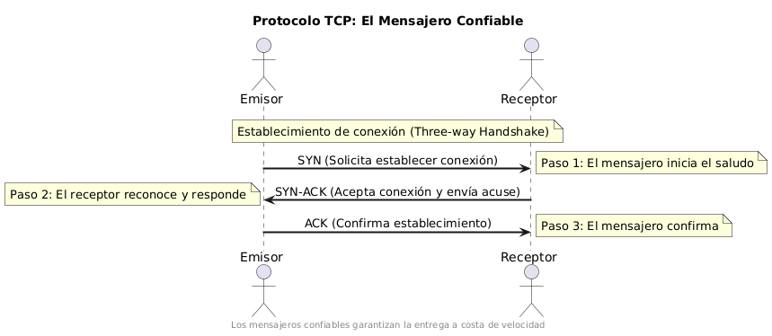
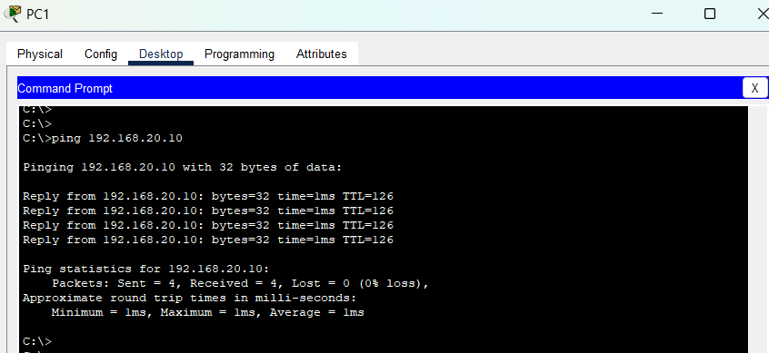

# Link del repositorio

https://paxuitogit.github.io/Examen-de-Redes-II-Binhao-Xu/

# Parte 1: Conceptos y Teoría

## 1. El mural de las Siete Capas 

### Te adentras en la sala principal del templo y descubres un gran mural compuesto por siete franjas horizontales superpuestas, decoradas con símbolos y jeroglíficos. Cada franja representa un nivel diferente en un ritual de comunicación. Los sabios de esta civilización entendían que un mensaje debía pasar por varias etapas desde su origen hasta su destino, refinándose o traduciendo su forma en cada nivel de la pirámide comunicativa.

### Pregunta: ¿Qué representa el mural de las siete capas en términos de las redes de comunicación modernas? Identifica brevemente cada capa y explica cómo se relaciona este antiguo “modelo” con el proceso de comunicación de datos actual.

El mural de las siete capas que representa en términos de las redes de comunicación moderna es el modelo OSI.


La explicacion breve de cada capa del modelo OSI es tal que:

- Capa 7 (Aplicación): Representa los servicios que interactúan directamente con el usuario, como HTTP o FTP.
- Capa 6 (Presentación): Se encarga de traducir, cifrar o comprimir los datos.
- Capa 5 (Sesión): Maneja las sesiones o conexiones entre sistemas.
- Capa 4 (Transporte): Garantiza la transferencia confiable de datos entre dispositivos.
- Capa 3 (Red): Se ocupa del ruteo y direccionamiento de paquetes.
- Capa 2 (Enlace de Datos): Controla el acceso al medio físico y corrige errores.
- Capa 1 (Física): Transmite señales físicas a través de medios como cables o fibra óptica.

Como se puede ver en el diagrama, cada una de las siete capas del modelo OSI se puede juntar en solo cuatro capas en el modelo TCP/IP y hacen lo mismo. La gran diferencia entre estos dos modelos es que el modelo OSI es la parte teórica y el modelo TCP/IP es la parte práctica y que se usa en casi todos los casos por su sencillez.


## 2. Los Dos Pergaminos del Mensajero

### En una cámara oculta encuentras dos pergaminos polvorientos. El primero describe el Ritual del Mensajero Confiable: antes de entregar un mensaje, el mensajero realiza un saludo de tres pasos con el receptor para asegurarse de que ambos estén listos, luego entrega el mensaje y espera una confirmación de recibido. Si la confirmación no llega, reintenta el envío. El segundo pergamino narra el Ritual del Mensajero Veloz: un mensajero que sale disparado a entregar mensajes sucesivos sin aviso previo ni asegurarse de la recepción, cubriendo la mayor distancia en el menor tiempo, aunque a veces los mensajes se pierdan en el camino.

### Pregunta: Interpreta los dos rituales descritos. ¿A qué protocolos de comunicación actuales equivalen el mensajero confiable y el mensajero veloz? Compara sus características, explicando las ventajas y desventajas de cada enfoque en redes modernas.

El mensajero confiable equivale al protocolo TCP y se sabe por el saludo de los tres pasos con el receptor, es decir, el three-way handshake.Lo que hace el saludo es establecer una conexión entre el emisor y receptor (cliente y servidor) y el proceso de los pasos es el siguiente:

- 1.SYN: El emisor envía un paquete de sincronización.
- 2.SYN-ACK: El receptor responde con sincronización y acuse de recibo (acuse es para confirmar de que los datos han llegado correctamente).
- 3.ACK: El emisor confirma la recepción y establece la conexión.

En caso de que no haya confirmación, se reintenta de nuevo la retransmisión.



En el caso del mensajero veloz, este representa el protocolo UDP y sus características son las siguientes:

- No establece una conexión previa entre el emisor y receptor.
- No verifica si los mensajes llegan a su destino.
- Es más rápido porque no presenta los mecanismos de verificación
- Acepta que algunos paquetes se pierdan y no se pueda recuperar.


### Comparación ventajas y desventajas entre TCP y UDP

| Característica | TCP (Mensajero Confiable) | UDP (Mensajero Veloz) |
|----------------|---------------------------|------------------------|
| **Establecimiento de conexión** | ✓ Requiere three-way handshake | ✓ No requiere establecimiento de conexión |
| **Garantía de entrega** | ✓ Garantiza que todos los datos lleguen | ❌ No garantiza la entrega de datos |
| **Orden de paquetes** | ✓ Mantiene el orden original de los datos | ❌ No garantiza el orden de los paquetes |
| **Control de congestión** | ✓ Implementa mecanismos para evitar saturar la red | ❌ No controla la congestión de la red |
| **Velocidad** | ❌ Más lento debido a las verificaciones | ✓ Mayor velocidad de transmisión |
| **Latencia** | ❌ Mayor latencia por establecimiento y control | ✓ Menor latencia (ideal para tiempo real) |
| **Tamaño de cabecera** | ❌ Mayor overhead (20-60 bytes) | ✓ Cabecera más pequeña (8 bytes) |
| **Uso de recursos** | ❌ Mayor consumo de recursos de red y sistema | ✓ Menor consumo de recursos |
| **Fiabilidad** | ✓ Alta fiabilidad en la transmisión | ❌ Baja fiabilidad |
| **Aplicaciones ideales** | Transferencia de archivos, correo electrónico, navegación web | Streaming, juegos en tiempo real, VoIP |

## 3. El Enigma de las Subredes

### Avanzando por un pasillo, encuentras una losa de piedra con inscripciones que parecen ser direcciones numéricas. Una inscripción cuenta: "Nuestro reino digital tenía la dirección sagrada 192.168.50.0. Los cuatro grandes gremios de la ciudad exigían su propio distrito en la red, todos de igual tamaño". Junto a esto, ves un diagrama borroso de algo que parecen ser subredes emanando de la dirección principal, cada una con su propio identificador.

### Pregunta: Descifra el enigma de la losa. Si la antigua red usaba la dirección 192.168.50.0 como base y necesitaba dividirse en 4 subredes de igual tamaño (una para cada gremio), ¿qué máscara de subred habrían utilizado los antiguos para lograrlo? ¿Cuántas direcciones de host (utilizables) tendría cada subred resultante? Explica brevemente tu razonamiento al calcular la máscara.

Para resolver el enigma, vayamos paso a paso:

Paso 1: Analizar la red base

- Como lo indica en el enunciado, nuestra dirección base es la 192.168.50.0 y con eso sabemos que tiene una máscara de 24 bits (255.255.255.0). Esto significa que los primeros 24 bits son la parte de red y los últimos 8 bits son la parte de host.

Paso 2: Calcular la cantidad de subredes

- Para crear 4 subredes, necesitamos 2 bits adicionales en la máscara de subred, ya que 2^2 = 4. Esto significa que tomamos 2 bits de la parte de host y los usamos para la parte de red, expandiendo la máscara de subred a 26 bits.

Paso 3: Determinar la nueva máscara de subred

- Como la máscara pasa a ser de 26 bits, en notación decimal queda como 255.255.255.192

Paso 4: Calcular la cantidad de direcciones de host

- Con la máscara 255.255.255.192, tenemos 6 bits restantes para la parte de host (32 - 26 = 6). La fórmula para calcular la cantidad de direcciones de host utilizables es 2^n - 2, donde n es el número de bits de host. Por lo tanto, 2^6 - 2 = 64 - 2 = 62.

Haciendo los cálculos, quedaría de la siguiente manera:

- Gremio 1: 192.168.50.0/26 (Rango de hosts: 192.168.50.1 - 192.168.50.62)

- Gremio 2: 192.168.50.64/26 (Rango de hosts: 192.168.50.65 - 192.168.50.126)

- Gremio 3: 192.168.50.128/26 (Rango de hosts: 192.168.50.129 - 192.168.50.190)

- Gremio 4: 192.168.50.192/26 (Rango de hosts: 192.168.50.193 - 192.168.50.254)

Explicación de la subred

Sabemos que el total de direcciónes es 2^(32 - 26) = 2^6 = 64, pero como la primera dirección es la dirección de red y la última es la dirección de broadcast, restamos 2, quedando 62 direcciones utilizables por subred. Es por eso que la 192.168.50.0 ni la 192.168.50.63 se pueden usar como direcciones de host.


## 4. La Encrucijada de las Rutas

### Llegas a una encrucijada dentro de las ruinas: cuatro caminos diferentes se extienden hacia distintas aldeas en los alrededores de la ciudad antigua. En el centro, un tótem tallado muestra flechas apuntando hacia cada camino, con inscripciones de destinos y distancias. Notas que algunas flechas parecen fijas e inmutables (talladas en la piedra), mientras que otras son piezas móviles que pudieron reorientarse si se abría o cerraba algún camino en el pasado. Este tótem se asemeja a un antiguo dispositivo de enrutamiento que dirigía el tráfico de datos por el camino adecuado.

### Pregunta: ¿Qué concepto moderno de redes representa el tótem con flechas de la encrucijada? Explica qué es una tabla de enrutamiento y cómo funciona en un router actual. Además, interpreta la diferencia entre las flechas talladas en piedra y las flechas móviles en términos de enrutamiento estático vs. enrutamiento dinámico en redes.

El tótem con flechas de la encrucijada representa una tabla de enrutamiento. Este antiguo artefacto se asemeja a un router moderno, que utiliza tablas de enrutamiento para guiar el tráfico de datos a través de la red.

Para entender más a fondo, una tabla de enrutamiento es una estructura de datos que almacena información sobre las rutas hacia diferentes destinos en una red. Básicamente tiene la función de un mapa que permite a los routers decidir cuál es el mejor camino para enviar los paquetes de datos a su destino.

Una tabla de enrutamiento típica contiene:
- **Destino**: La dirección IP de la red o host al que se desea llegar.
- **Máscara de subred**: Define el rango de direcciones IP que pertenecen a esa red.
- **Puerta de enlace (Gateway)**: La dirección IP del siguiente salto o router al que se debe enviar el paquete.
- **Interfaz**: La interfaz de red a través de la cual se enviará el paquete.
- **Métrica**: Un valor que indica la "distancia" o costo de la ruta, utilizado para determinar la mejor ruta entre múltiples opciones.

Funcionamiento de la tabla de enrutamiento:

Cuando un router recibe un paquete de datos, hace lo siguiente:

- 1.Examina la dirección IP de destino del paquete.
- 2.Consulta su tabla de enrutamiento para encontrar la mejor ruta hacia ese destino.
- 3.Determina la siguiente "parada" o salto(next hop) para el paquete.
- 4.Envía el paquete a través de la interfaz correspondiente hacia la puerta de enlace especificada.

Si el router no encuentra una ruta específica para el destino, puede enviar el paquete a una puerta de enlace predeterminada o descartarlo.

Flechas talladas en piedra vs. flechas móviles: Enrutamiento estático vs. dinámico

Las flechas fijas e inmutables representan el enrutamiento estático:

- Tienen rutas predefinidas y no cambian a menos que un administrador las modifique manualmente.
- No cambian automáticamente ante fallos o cambios en la red.
- Son preecibles y fiables en entornos estables.
- Consumen meno recursos del router.
- Tienen mayor control sobre la ruta que toman los paquetes.

Las flechas móviles representan el enrutamiento dinámico:

- Las rutas se crean y actualizan automáticamente.
- Se ajustan ante  cambios en la red, como fallos de enlaces o cambios en la topología.
- Uso de protocolos de enrutamiento como RIP, OSPF o BGP para intercambiar información de rutas entre routers.
- Requiere más recursos y procesamiento, pero es más flexible y adaptable a cambios en la red.
- Los routers comparten información sobre la topología de la red y pueden aprender nuevas rutas.
- Pueden encontrar rutas alternativas si una ruta falla.

### Tabla comparativa: Enrutamiento estático vs. Enrutamiento dinámico

| Característica | Enrutamiento estático (flechas talladas) | Enrutamiento dinámico (flechas móviles) |
|----------------|------------------------------------------|----------------------------------------|
| **Configuración** | Manual por el administrador | Automática mediante protocolos |
| **Adaptación a cambios** | No se adapta automáticamente | Se ajusta ante cambios en la topología |
| **Uso en redes** | Pequeñas o muy estables | Medianas y grandes |
| **Consumo de recursos** | Bajo | Medio-alto |
| **Protocolo** | No usa protocolos de enrutamiento | Usa protocolos como RIP, OSPF, BGP |
| **Mantenimiento** | Requiere intervención manual | Se mantiene automáticamente |
| **Escalabilidad** | Limitada | Alta |
| **Intercambio de información** | No comparte información con otros routers | Los routers comparten información de rutas |
| **Recuperación ante fallos** | No responde automáticamente | Busca rutas alternativas |
| **Predictibilidad** | Alta (rutas siempre conocidas) | Variable (depende del estado de la red) |

## 5. El Guardián de la Máscara Única

### En la última sala del templo, frente a la salida, te encuentras con la estatua de un guardián con dos caras. Según una leyenda grabada en la base, este guardián protegía la ciudad oculta de los forasteros. Cuando un mensajero salía de la ciudad, el guardián reemplazaba su máscara por la suya propia, de modo que, para el mundo exterior, todos los mensajes parecían venir únicamente del guardián. Al regresar la respuesta, el guardián recordaba qué máscara original correspondía a cada mensaje y reenviaba la respuesta al habitante correcto dentro de la ciudad. Gracias a este ardid, la ciudad pudo ocultar la identidad de sus miembros y usar un único rostro para todas sus comunicaciones externas.

### Pregunta: ¿Qué técnica de redes moderna se refleja en la leyenda del Guardián de la Máscara? Nombra y describe brevemente este mecanismo, explicando cómo permite que múltiples dispositivos internos de una red compartan una única identidad (dirección) al comunicarse con el exterior, y menciona dos beneficios que brinda esta estrategia a las redes actuales.

La leyenda del Guardián de la Máscara describe la técnica de NAT (Network Address Translation), que permite que múltiples dispositivos internos de una red compartan una única dirección IP al comunicarse con el exterior.

El NAT actúa como un intermediario entre la red interna y el mundo exterior. Cuando un dispositivo interno envía un paquete a Internet, el NAT reemplaza la dirección IP de origen del paquete con su propia dirección IP pública. Luego, mantiene un registro de esta traducción para que cuando llegue la respuesta, pueda reenviarla al dispositivo interno correcto.

El funcionamiento básico del NAT es el siguiente:

1. Un dispositivo interno (por ejemplo, un ordenador) envía un paquete a Internet.
2. El router NAT recibe el paquete y reemplaza la dirección IP de origen del dispositivo interno con su propia dirección IP pública.
3. El router NAT guarda la información de la traducción en una tabla de traducción.
4. Cuando el paquete de respuesta llega al router NAT, este consulta su tabla de traducción para determinar a qué dispositivo interno debe reenviar la respuesta.
5. El router NAT reemplaza la dirección IP de destino del paquete con la dirección IP interna del dispositivo y lo envía a su destino.

Los tipos más comunes de NAT son:
- **NAT estático**: Asigna una dirección IP pública fija a una dirección IP privada.
- **NAT dinámico**: Utiliza un grupo de direcciones IP públicas que se asignan dinámicamente.
- **PAT (Port Address Translation) o NAT con sobrecarga**: La forma más común de NAT, donde múltiples dispositivos internos comparten una única dirección IP pública utilizando diferentes puertos.

Los beneficios de usar una NAT son:
1. **Conservación de direcciones IP**: Permite que múltiples dispositivos internos compartan una única dirección IP pública, lo que es especialmente útil en redes con un número limitado de direcciones IP disponibles.
2. **Seguridad**: Oculta las direcciones IP internas de los dispositivos, lo que dificulta que los atacantes externos identifiquen y accedan a los dispositivos internos de la red. Esto actúa como una capa adicional de seguridad, ya que los dispositivos internos no son directamente accesibles desde Internet.

# Parte 2: Práctica con Cisco Packet Tracer

## Ejercicio 1: La Ruta Perdida entre Dos Reinos

### Tras salir del templo, el diario del aventurero te conduce a los restos de dos ciudades hermanas separadas por un vasto desierto. Según los relatos, en la antigüedad estas ciudades (reinos) estaban conectadas por la Ruta Sagrada de Datos, un enlace de comunicación que permitía compartir conocimiento y recursos. Con el tiempo, la ruta cayó en el olvido y las ciudades quedaron incomunicadas, como islas aisladas. Tu misión es reconstruir esa ruta perdida para volver a unir las redes de ambas ciudades.

### En términos actuales, cada ciudad tiene su propia red local (subred) y disponía de un router en su gran torre de comunicaciones. Entre ambas torres existía un enlace directo (un cable histórico que unía las dos ciudades). También se encontraban switches en las plazas centrales de cada ciudad, conectando los ordenadores (PCs) de los habitantes. Para restaurar la conexión, tendrás que configurar apropiadamente los dispositivos de ambas urbes y el enlace entre ellas.

Para restaurar la conexión entre las dos ciudades, seguiremos los siguientes pasos:

### Paso 1: Configuración inicial del entorno

1. **Abrir Cisco Packet Tracer** y crear un nuevo proyecto.

2. **Añadir los dispositivos de red:**
   - Dos routers (Router1 y Router2) → *Representan las torres de comunicaciones de cada ciudad*
   - Dos switches (Switch1 y Switch2) → *Representan las plazas centrales de cada ciudad*
   - Cuatro PCs (PC0, PC1, PC2 y PC3) → *Representan los ordenadores de los habitantes*

3. **Establecer las conexiones:**
   - Utilizar cable cruzado para conectar Router1 con Router2 
   - Utilizar cables directos para conectar:
     * Router1 con Switch1
     * Router2 con Switch2
     * Switch1 con PC0 y PC1
     * Switch2 con PC2 y PC3


### Paso 2: Configuración de las direcciones IP

Para este ejercicio usaremos:

Red Ciudad A: 192.168.10.0/24
Red Ciudad B: 192.168.20.0/24
Enlace entre routers: 192.168.30.0/30

### Paso 3: Configuración de los dispositivos

Configuración del Router Ciudad A:

```
Router> enable
Router# configure terminal
Router(config)# hostname RouterA
RouterA(config)# interface GigabitEthernet0/0
RouterA(config-if)# ip address 192.168.10.1 255.255.255.0
RouterA(config-if)# no shutdown
RouterA(config-if)# exit

# Añadir ruta estática hacia Ciudad B
RouterA(config)# ip route 192.168.20.0 255.255.255.0 192.168.30.2
RouterA(config)# exit
RouterA# write memory
```

Configuración del Router Ciudad B:

```
Router> enable
Router# configure terminal
Router(config)# hostname RouterB
RouterB(config)# interface GigabitEthernet0/0
RouterB(config-if)# ip address 192.168.20.1 255.255.255.0
RouterB(config-if)# no shutdown
RouterB(config-if)# exit

# Añadir ruta estática hacia Ciudad A
RouterB(config)# ip route 192.168.10.0 255.255.255.0 192.168.30.1
RouterB(config)# exit
RouterB# write memory
```

#### Configuración de los PCs en Ciudad A:
Por ejemplo, para PC0 en Ciudad A le asignaremos:

```
Dirección IP: 192.168.10.10
Máscara de subred: 255.255.255.0
Gateway predeterminado: 192.168.10.1
```
Para PC1 en Ciudad A le asignaremos:

```
Dirección IP: 192.168.10.11
Máscara de subred: 255.255.255.0
Gateway predeterminado: 192.168.10.1
```

#### Configuración de los PCs en Ciudad B:
Para PC2 en Ciudad B le asignaremos:

```
Dirección IP: 192.168.20.10
Máscara de subred: 255.255.255.0
Gateway predeterminado: 192.168.20.1
```

Para PC3 en Ciudad B le asignaremos:

```
Dirección IP: 192.168.20.11
Máscara de subred: 255.255.255.0
Gateway predeterminado 192:168.20.1
```
### Paso 4: Verificación de la conectividad
Para verificar la conectividad entre las dos ciudades, puedes usar el comando `ping` desde los PCs. Por ejemplo, desde PC0 en Ciudad A, intenta hacer ping a PC2 en Ciudad B:

```
ping 192.168.20.10
```


Lo mismo pasará si haces ping desde PC2 a PC0:

```
ping 192.168.10.10
```


Se muestran que ambos PCs pueden comunicarse entre sí, lo que indica que la Ruta Sagrada de Datos ha sido restaurada con éxito.

## Ejercicio 2: El Guardián de la Máscara Única

### Tras conectar las dos ciudades, te internas en las ruinas de la gran metrópolis central. Descubres que esta ciudad antigua estaba dividida en facciones o gremios, cada uno operando en su propio “canal sagrado” de comunicaciones para evitar interferencias con los otros. A pesar de compartir la misma infraestructura física (todas las guildas estaban en la misma ciudad y conectadas por los mismos caminos), utilizaron alguna forma de segmentación para que sus mensajes viajaran aislados, como si existieran redes paralelas invisibles dentro de la misma urbe. Solo en la Gran Torre Central (el edificio del consejo, equivalente a un router moderno) se unían estas comunicaciones, permitiendo el intercambio de mensajes entre gremios cuando era necesario, bajo supervisión.

### En tecnología de redes actual, lo que has descubierto es una ciudad implementada con VLANs (Redes Locales Virtuales) para separar el tráfico de cada gremio, y un enrutamiento router-on-a-stick (router con subinterfaces) en la torre central para interconectarlas de forma controlada. ¡Tu tarea es revivir esta arquitectura de red segmentada!

Elemenos necesarios para la configuración:
- Router: 1
- Switch: 1
- PCs: 4

Paso 1: Configuración inicial del entorno
1. **Abrir Cisco Packet Tracer** y crear un nuevo proyecto.
2. **Añadir los dispositivos de red:**
   - Un router (Router1) → *Representa la Gran Torre Central*
   - Un switch (Switch1) → *Representa la infraestructura de la ciudad*
   - Cuatro PCs (PC0, PC1, PC2 y PC3) → *Representan los gremios*
3. **Establecer las conexiones:**
   - Utilizar cable cruzado para conectar Router1 con Switch1 
   - Utilizar cables directos para conectar:
     * Router1 con Switch1
     * Switch1 con PC0 y PC1
     * Switch1 con PC2 y PC3


### Paso 2: Configuración de Switch y VLANs

1. **Acceder al switch** y crear las VLANs para cada gremio:

```
Switch> enable
Switch# configure terminal
Switch(config)# vlan 10
Switch(config-vlan)# name Arquitectos
Switch(config-vlan)# exit
Switch(config)# vlan 20
Switch(config-vlan)# name Escribas
Switch(config-vlan)# exit
```

4. **Asignar los puertos a las VLANs**:

```
Switch(config)# interface range fa0/2 - 3
Switch(config-if-range)# switchport mode access
Switch(config-if-range)# switchport access vlan 10
Switch(config-if-range)# exit
Switch(config)# interface range fa0/4 - 5
Switch(config-if-range)# switchport mode access
Switch(config-if-range)# switchport access vlan 20
Switch(config-if-range)# exit
```

Configurar el puerto de enlace troncal (trunk) para la comunicación entre el router y el switch:

```
Switch(config)# interface gi0/1
Switch(config-if)# switchport mode trunk
Switch(config-if)# exit
```
### Paso 3: Configuración del Router
1. **Acceder al router** y crear subinterfaces para cada VLAN:

```
Router> enable
Router# configure terminal
Router(config)# interface gigabitEthernet 0/0
Router(config-if)# no shutdown
Router(config-if)# exit
```

Configuramos VLAN 10:

```
Router(config)# interface gigabitEthernet 0/0.10
Router(config-subif)# encapsulation dot1Q 10
Router(config-subif)# ip address 192.168.10.1 255.255.255.0
Router(config-subif)# exit
```

Configuramos VLAN 20:

```
Router(config)# interface gigabitEthernet 0/0.20
Router(config-subif)# encapsulation dot1Q 20
Router(config-subif)# ip address 192.168.20.1 255.255.255.0
Router(config-subif)# exit
```

### Paso 4: Configuración de los PCs

Para los PCs de la VLAN 10 (Arquitectos):
- PC0:
**Dirección IP**: 192.168.10.2
**Máscara de red**: 255.255.255.0
**Gateway predeterminado**: 192.168.10.1
- PC1:
**Dirección IP**: 192.168.10.3
**Máscara de red**: 255.255.255.0
**Gateway predeterminado**: 192.168.10.1

Para los PCs de la VLAN 20 (Escribas):
- PC2:
**Dirección IP**: 192.168.20.2
**Máscara de red**: 255.255.255.0
**Gateway predeterminado**: 192.168.20.1
- PC3:
**Dirección IP**: 192.168.20.3
**Máscara de red**: 255.255.255.0
**Gateway predeterminado**: 192.168.20.1

### Paso 5: Verificación de la conectividad
Para verificar la conectividad entre los PCs de diferentes VLANs, puedes usar el comando `ping` desde los PCs. Por ejemplo, desde PC0 en la VLAN 10, intenta hacer ping a PC2 en la VLAN 20 y también PC0 a PC1:

```
ping 192.168.10.3
```

```
ping 192.168.20.2
```


### Referencias

1. [Modelo OSI - Wikipedia](https://es.wikipedia.org/wiki/Modelo_de_interconexi%C3%B3n_de_sistemas_abiertos)
2. [Modelo TCP/IP - Wikipedia](https://es.wikipedia.org/wiki/Modelo_TCP/IP)
3. [Protocolo TCP - IONOS](https://www.ionos.es/digitalguide/servidores/know-how/que-es-tcp-transport-control-protocol/)
4. [Protocolo UDP - IONOS](https://www.ionos.es/digitalguide/servidores/know-how/udp-user-datagram-protocol/)
5. [Tabla de enrutamiento - RedesZone](https://www.redeszone.net/tutoriales/redes-cable/tabla-enrutamiento-router-que-es/)
6. [NAT (Network Address Translation) - Cisco](https://www.cisco.com/c/es_mx/support/docs/ip/network-address-translation-nat/26704-nat-faq-00.html)
